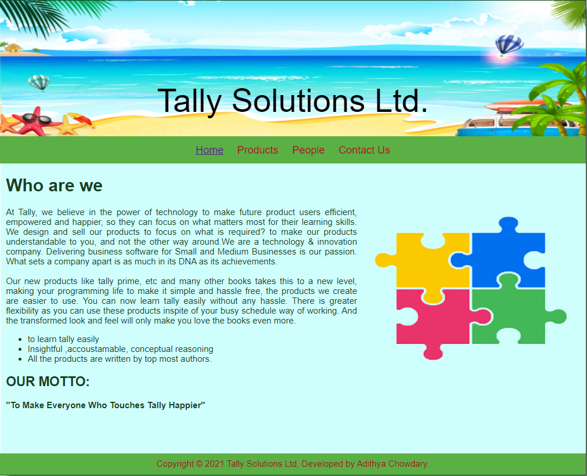
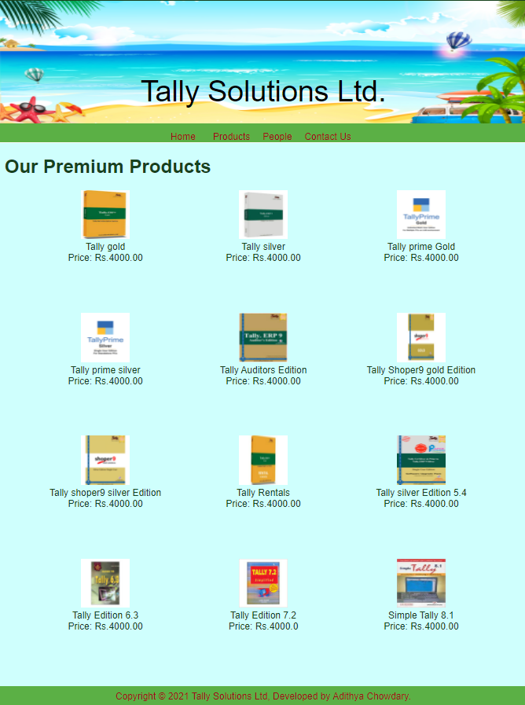
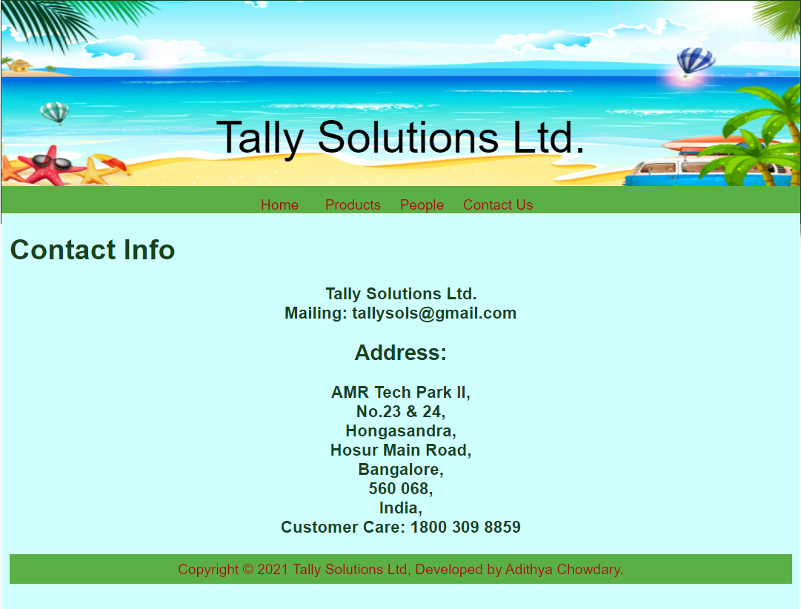

# Web Design for a Software Product Company

## AIM:

To design a static website for a software product company company.

## DESIGN STEPS:

### Step 1:

Requirement collection.

### Step 2:

Creating the layout using HTML and CSS.

### Step 3:

Updating the sample content.

### Step 4:

Choose the appropriate style and color scheme.

### Step 5:

Validate the layout in various browsers.

### Step 6:

Validate the HTML code.

### Step 6:

Publish the website in the given URL.

## PROGRAM :
## Home.html:
~~~
<!DOCTYPE html>
<html lang="en">
  <head>
    <title>Tally Solutions Ltd.</title>
    <link rel="stylesheet" href="./css/layout.css" />
    <link rel="icon" href="./img/icon.png" type="image/x-icon" />
  </head>

  <body>
    

      
Tally Solutions Ltd.

      

        
<a href="/static/home.html">Home</a>

        
<a href="/static/products.html">Products</a>

        
<a href="/static/produts.html">People</a>

        
<a href="/static/Contact Us.html">Contact Us</a>

      

      

        

          <h1>Who are we</h1>
          
          

            At Tally, we believe in the power of technology to make future 
            product users efficient, empowered and happier, so they can focus on what
            matters most for their learning skills. We design and sell our
             products to focus on what is required? to make our products understandable to you,
              and not the other way around.We are a technology & innovation company. 
              Delivering business software for Small and Medium Businesses is our passion.
              What sets a company apart is as much in its DNA as its achievements. 
             
             
            Our new products like tally prime, etc and many other books
             takes this to a new level, making your programming life to make it
            simple and hassle free, the products we create are easier to use.
            You can now learn tally easily without any hassle.
            There is greater flexibility as you can use these products inspite of your busy schedule
            way of working. And the transformed look and feel will only make you
            love the books even more.
            <ul>
              <li>to learn tally  easily</li>
              <li>Insightful ,accoustamable, conceptual reasoning</li>
              <li>All the products are written by top most authors.</li>
            </ul>
            <h2>OUR MOTTO:</h2>
            <b>"To Make Everyone Who Touches Tally Happier"</b>
          

        

      

      

        Copyright &#169; 2021 Tally Solutions Ltd, Developed by Adithya Chowdary.
      

    

  </body>
</html>
~~~
### Products.html:
~~~
<!DOCTYPE html>
<html lang="en">
  <head>
    <title>Tally Solutions Ltd</title>
    <link rel="stylesheet" href="./css/layout.css" />
    <link rel="icon" href="./img/icon.png" type="image/x-icon" />
  </head>
  <body>
    

      
Tally Solutions Ltd.

      

        
<a href="/static/home.html">Home</a>

        

        
<a href="/static/products.html">Products</a>

        
<a href="/static/people.html">People</a>

        
<a href="/static/Contact US.html">Contact Us</a>

      

      

        
    
          <h1>Our Premium Products</h1>
          

              
 
                  

                  
                  

                  
Tally gold

                  
Price: Rs.4000.00 

              

              
 
                  

                  
                  

                  
Tally silver

                  
Price: Rs.4000.00 

              

              

                

                  
                

                
Tally prime Gold

                
Price: Rs.4000.00

              

              

                

                  
                  

                  
Tally prime silver

                  
Price: Rs.4000.00

          

          

            

              
              

              
Tally Auditors Edition

              
Price: Rs.4000.00

      

      

        

          
          

          
Tally Shoper9 gold Edition

          
Price: Rs.4000.00

  

  

    

      
      

      
Tally shoper9 silver Edition

      
Price: Rs.4000.00

  

    
    

    
Tally Rentals

    
Price: Rs.4000.00

  

    
    

    
Tally silver Edition 5.4

    
Price: Rs.4000.00

  

    
    

    
Tally Edition 6.3

    
Price: Rs.4000.00

  

    
    

    
Tally Edition 7.2

    
Price: Rs.4000.0

  

    
    

    
Simple Tally 8.1

    
Price: Rs.4000.00

          
        
      

      

        Copyright &#169; 2021 Tally Solutions Ltd, Developed by Adithya Chowdary.
      

    

  </body>
</html>
~~~
### People.html:
~~~
<!DOCTYPE html>
<html lang="en">
  <head>
    <title>Tally Solutions Ltd</title>
    <link rel="stylesheet" href="./css/layout.css" />
    <link rel="icon" href="./img/icon.png" type="image/x-icon" />
  </head>
  <body>
    

      
Tally Solutions Ltd.

      

        
<a href="/static/home.html">Home</a>

        

        
<a href="/static/products.html">Products</a>

        
<a href="/static/people.html">People</a>

        
<a href="/static/Contact Us.html">Contact Us</a>

      

      

        
    
          <h1>Our beloved management</h1>
          

              
 
                  

                  
                  

                  
Shyam Sundar Goenka

                  
LATE Chairperson of Tally solutions 

              

               
              
 
                  

                  
                  

                  
Sheela Goenka

                  
Current chairperson of Tally solutions

              

               
              

                

                  
                

                
Bharat Goenka

                
CEO of Tally solutions

              

               
              

                

                  
                  

                  
Tejas Goenka

                  
Managing director of Tally solutions

          

           
          

            

              
              

              
Ganesh.S

              
Chief Financial officer

      

      
          
        
      

      

        Copyright &#169; 2021 Tally Solutions Ltd, Developed by Adithya Chowdary.
      

    

  </body>
</html>
~~~
### Contact US.html:
~~~
<!DOCTYPE html>
<html lang="en">
  <head>
    <title>Tally Solutions Ltd</title>
    <link rel="stylesheet" href="./css/layout.css" />
    <link rel="icon" href="./img/icon.png" type="image/x-icon" />
  </head>
  <body>
    

      
Tally Solutions Ltd.

      

        
<a href="/static/home.html">Home</a>

        

        
<a href="/static/products.html">Products</a>

        
<a href="/static/people.html">People</a>

        
<a href="/static/Contact US.html">Contact Us</a>

      

      

        
    
          <h1>Contact Info</h1>
          <h3>
            Tally Solutions Ltd.
             
            Mailing: tallysols@gmail.com
             
            Phone: 1800 309 8859.
             <h2>Address:</h2>
            </h3>
            <h3>
            AMR Tech Park II,
             
            No.23 & 24,
             
            Hongasandra,
             
            Hosur Main Road,
              
            Bangalore,
              
            560 068,
              
            India,
          </h3>
      

        Copyright &#169; 2021 Tally Solutions Ltd, Developed by Adithya Chowdary.
      

    

  </body>
</html>
~~~

## OUTPUT:

### Home Page:

## Result:

Thus a website is designed for the software product company and the HTML,CSS code are validated.
